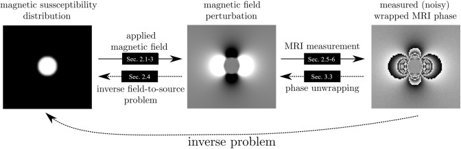

Quantitive Susceptibility Mapping
=================================

Overview
^^^^^^^^
The goal of QSM is to recover information about the the magnetic properties of brain tissue 
(its susceptibility value). This manifests as magnetic field changes generated (primarily) 
by iron in tissue and this can be detected using certain MR imaging sequences (gradient-echo). 
The degree of field change is directly proportional to the quantity of substance in the tissues. 
This is currently useful for certain structures - particularly deep grey matter as the field here 
seems to be dominated by iron (see 
`Langkammer C et al. NeuroImage 2012 <https://www.sciencedirect.com/science/article/pii/S105381191200537X>`_ 
and his infamous Figure 3) and so is likely proportional specifically to iron concentration.

As you can imagine, getting at this subtle, local field information is tricky and easily contaminated 
by other factors (global imperfections in our magnet, etc.). The maths behind recovering the information 
is conceptually simple but is in fact rather difficult to implement in practice. For example there 
are lots of points in creating the map where the QSM algorithm will be trying to divide by zero. 
Thus recovering the QSM value (going from ‘field to source’) in susceptibility research is often 
referred to as an ‘ill-posed problem’.

The following figure from 
`Ferdinand Schweser <https://www.sciencedirect.com/science/article/pii/S0939388915001427?via%3Dihub>`_ 
illustrates the QSM problem:

**The main issue with QSM is that there is currently no agreed protocol on the MRI side for acquiring QSM 
images and a multitude of software packages to do the QSM processing.**

Steps and theory
^^^^^^^^^^^^^^^^

1. **Data Acquisition** 

We acquire the data using a T2* sequence in order to collect field information (this does not correct 
for the local field inhomogeneities — unlike a T2/spin-echo sequence). For MS Gait we are using a 9-echo 
bipolar multi-echo sequence as this gives us the opportunity to average QSM maps from a number of echoes 
(as opposed to the minimum of one echo) to a obtain a 'higher-quality’ mean map.

We use the phase images from the MRI scanner to eventually create the QSM map. MRI data is complex and 
has real and imaginary components. These two components are needed for the 
Fourier transform to work properly. On an Argand diagram, we can express these components geometrically. 
This allows us to calculate the actual *magnitude* image. But we can also see the phase difference (ϕ) 
between the real and imaginary components. (Until a few years ago, this phase information was usually 
discarded as it was felt to contain little useful information).

2. **Multi coil combining & phase offset correction**

TBC

3. **Phase unwrapping**

TBC

4. **Background phase removal**

TBC

5. **Calculate the QSM value from unwrapped, phase processed data**

TBC

NOTE: Thanks to Jon Cleary for writing much of this great summary. 
